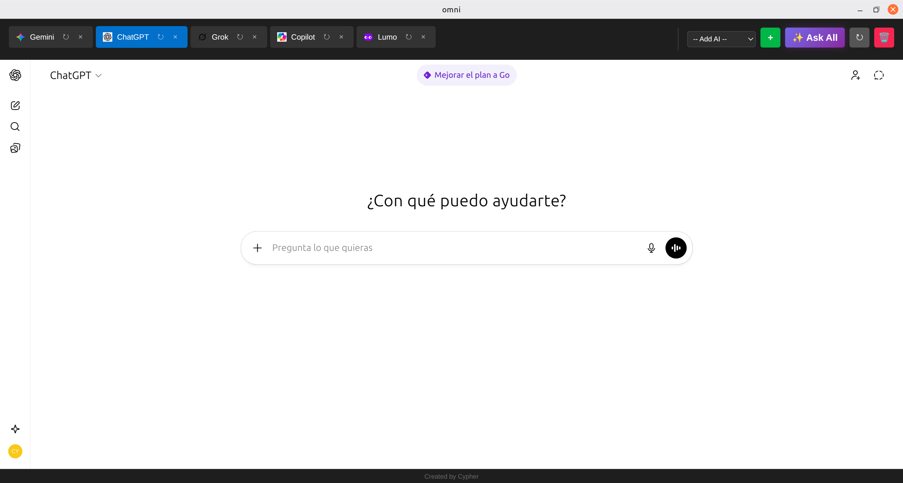

# Omni

**Omni** is a powerful and unified workspace designed to manage multiple AI assistants in a single, efficient application. Instead of juggling multiple browser tabs, Omni provides a streamlined, seamless interface to interact with various AI services simultaneously.



## 📥 Download (v1.4.3)

| OS | Link |
| :--- | :--- |
| **Windows** | [Download .exe](https://github.com/Cypher1984GIT/Omni/releases/download/v1.4.3/Omni-Setup-1.4.3.exe) |
| **Mac (Universal: Intel + Apple Silicon)** | [Download .dmg](https://github.com/Cypher1984GIT/Omni/releases/download/v1.4.3/Omni-1.4.3-universal.dmg) |
| **Linux (Debian/Ubuntu)** | [Download .deb](https://github.com/Cypher1984GIT/Omni/releases/download/v1.4.3/omni_1.4.3_amd64.deb) |
| **Linux (Universal)** | [Download .AppImage](https://github.com/Cypher1984GIT/Omni/releases/download/v1.4.3/Omni-1.4.3.AppImage) |

## ✨ Latest Updates (v1.4.3)
- **Cleaner Interface**: Maximized screen real estate by removing the bottom footer.
- **Unified Help Center**: Moved version info and update management to the Help menu.
- **Smart Notifications**: A visual indicator now appears on the Help icon when a new update is available.
- **Enhanced UX**: Simplified settings and update flows for a distraction-free experience.

## Supported AIs
- **General**: ChatGPT, Gemini, Grok, Copilot, Claude, Perplexity, Blackbox, DeepSeek, Qwen, Z.ai
- **Private**: DuckDuckGo, Lumo (Proton), Okara

> ⚠️ **Windows Note**: Since this app is not signed with an official enterprise certificate, Windows SmartScreen may flag it as an "Unrecognized App". To install, click **"More info"** and then **"Run anyway"**. This is normal for open-source software.

## How It Works

Omni wraps different web-based AI interfaces into dedicated, persistent tabs. It leverages Electron's `BrowserView` capability to ensure that each AI session is independent and secure, allowing for:
- **Persistent Sessions**: Your logins and states are saved across restarts.
- **Dynamic Layout**: The interface adapts to provide a maximum viewing area for your conversations.
- **Smart Error Handling**: Automatically detects if an AI service blocks access or fails to load, providing a user-friendly retry mechanism.
- **Tab Management**: Easily switch between, reload, or remove AI helpers as needed.
- **Incognito Mode**: Optional private sessions for individual AI tabs.

## Technology Stack

Omni is built with modern web technologies and robust desktop framework tools:
- **Electron**: For cross-platform desktop application capabilities.
- **Node.js**: Handling the backend logic and processes.
- **HTML5 & CSS3**: For a responsive and custom-styled user interface.
- **Tailwind CSS**: For high-performance, modern styling.
- **JavaScript (Vanilla)**: Core application logic without unnecessary overhead.

## Development & Installation

To run Omni from source or contribute to its development, follow these steps:

### Prerequisites
- [Node.js](https://nodejs.org/) (Recommended: LTS version)
- [Git](https://git-scm.com/)

### Setup
1. **Clone the repository**:
   ```bash
   git clone https://github.com/Cypher1984GIT/Omni.git
   cd Omni
   ```

2. **Install dependencies**:
   ```bash
   npm install
   ```

3. **Run the app**:
   ```bash
   npm start
   ```

### Building for Production
To generate the executables (like `.exe` or `.AppImage`) locally:
```bash
npm run build
```

## Privacy & Security

Omni is designed with privacy as a priority.
- **Local Data**: All cookies, session data, and preferences are stored locally on your device.
- **Direct Connection**: The application connects directly to the AI service providers. No chat data or credentials are routed through or stored on external servers managed by Omni.
- **Transparency**: As an open-source project, the code is fully auditable to ensure no hidden tracking exists.

## Open Source

This project is **Open Source**. We believe in the power of community and transparency. You are free to explore, modify, and contribute to the codebase.

## Author

Developed by **Cypher1984**.
